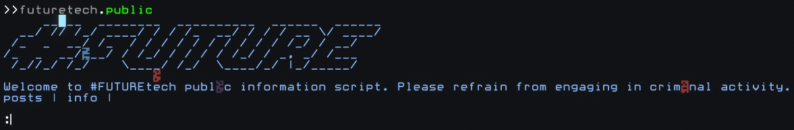
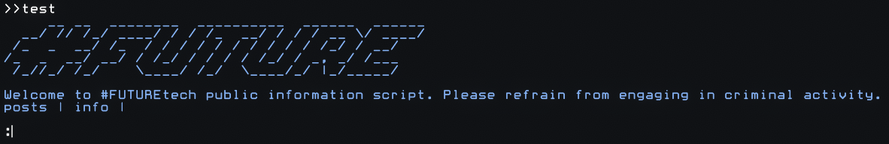

# chaos_computer_club 's' library 0

One of ccc's public library accounts in the computer game HACKMUD. 

---

```let repaired = repairCall(callback, callbackArgs)```

This is an example of corrupted text returned from a public.


This is repaired text from the same public using this test script:

```
let lib = #fs.cccslib0.lib()
let futuretech = () => #fs.futuretech.public()
return lib.repairCall(futuretech)
```


