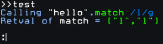

# chaos_computer_club 's' library 0

One of ccc's public library accounts in the computer game HACKMUD. 

---

## repairCall

```
let repaired = repairCall(callback, callbackArgs)
```

This is an example of corrupted text returned from a public.


This is repaired text from the same public using this test script:

```js
let lib = #fs.cccslib0.lib()
let futuretech = () => #fs.futuretech.public()
return lib.repairCall(futuretech)
```


## strProxy

```js
let lib = #fs.cccslib0.lib()
let json = JSON.stringify

function argFilter(str, func, ...args) {
    #D(`Calling \`1${json(str)}\`.\`2${func}\` \`3${args}\``)
    return args
}

function retFilter(str, func, ret) {
    #D(`Retval of \`1${func}\` = \`2${json(ret)}\``)
    return ret
}

let s = "hello"
let p = lib.strProxy(s, argFilter, retFilter)

// When p.match is executed, it'll first run argFilter with
// the supplied arguments, allowing for modification before
// it is passed to s.match. After s.match return, retFilter
// will be called with s' result, allowing for modification
// before it is returned to the caller.
// Effectively it mimics a string to some extent. 
p.match(/l/g) 
```


## scrProxy

Allows code to be executed before and after a scriptor called, when passed to another script. To some extent can this be used to reverse engineer other peoples code, especially when paired with strProxy. Can be used to fish out entries for your database by looking at arguments passed to the real scriptor. Follows a similar pattern to strProxy with a argFilter and retFilter, allowing to trick other peoples code to execute paths they might have no consideration of.
